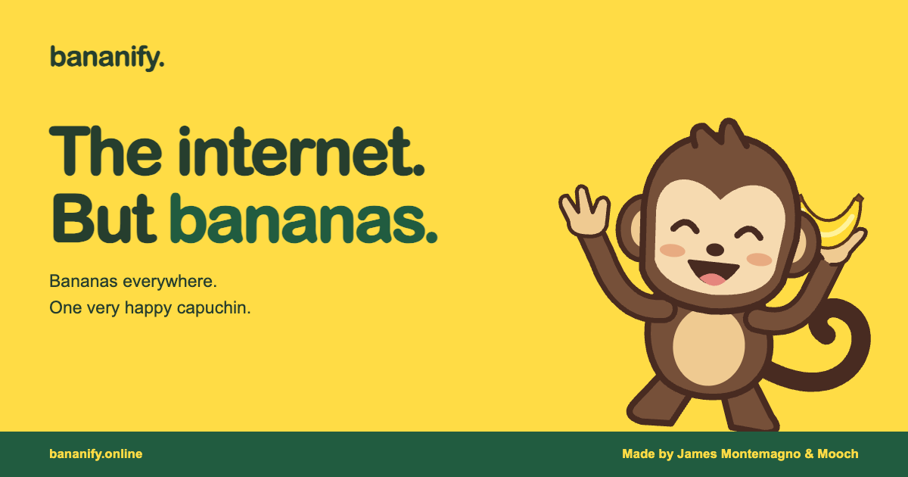

# Bananify

[](https://bananify.online)

Turn everyday websites into a banana party. Bananify is a free, open-source **Chrome and Microsoft Edge extension** that fills your page with bananas and invites a dancing monkey to celebrate.

**[Try the live demo](https://bananify.online)** | **[Download Bananify](https://github.com/jamesmontemagno/bananify/releases/latest/download/bananify-extension.zip)** | **[Release notes](https://github.com/jamesmontemagno/bananify/releases)**

Made by **James Montemagno & Mooch**.

## A little more banana, a little less ordinary

- **Bananas everywhere.** A banana shower, floating decorations, and a little confetti when you click.
- **A surprise party guest.** Each party invites a brown capuchin, black-and-white capuchin, or golden monkey.
- **Your page, bananified.** Random images and short text temporarily look like bananas without moving the page layout. Forms, links, navigation, and editable content are left alone.
- **Easy on, easy off.** Add more bananas, pause the animation, or restore the page. Reduced-motion preferences get a static party.

Want a taste before installing? The [live demo](https://bananify.online) runs the same banana party right in your browser.

## Install in Chrome or Edge

Bananify is currently available as a **manual install**, not through the Chrome Web Store or Microsoft Edge Add-ons.

1. [Download **bananify-extension.zip**](https://github.com/jamesmontemagno/bananify/releases/latest/download/bananify-extension.zip) and extract it.
2. Open `chrome://extensions` in Chrome or `edge://extensions` in Edge.
3. Enable **Developer mode**.
4. Click **Load unpacked** and select the extracted **bananify** folder containing `manifest.json`.
5. Pin **Bananify** from the browser's Extensions menu.
6. Visit a regular website and click the banana in your toolbar.

Keep the extracted folder: the browser loads the extension from there. Use the release ZIP above, not GitHub's automatic source-code archives.

### Let the party begin

Click the toolbar banana to start or stop the party. **More bananas** turns up the shower, brings a different monkey, and disguises more page elements. **Pause** freezes the animation; **Restore page** removes the party and restores the disguised elements.

The party stays on the page where you started it and resets when you navigate or reload. Browser settings, extension stores, and some built-in viewers cannot be bananified; a `!` badge and toolbar tooltip explain when a page is off-limits.

### Updating

Unpacked extensions do not update automatically. Download the [latest release](https://github.com/jamesmontemagno/bananify/releases/latest), replace the files in your existing extension folder, click **Reload** on the browser's Extensions page, and refresh your website tabs. Every release includes installation notes and a SHA-256 checksum.

## Runs locally. No tracking.

Bananify acts on the tab you choose when you click its toolbar button. It uses only `activeTab` and `scripting` permissions, with no always-on access to your websites.

The extension processes page content and click positions locally to place the bananas. It makes **no network requests**, sends no page content anywhere, and uses no analytics or persistent storage. The artwork is bundled with the extension. The separate demo website is hosted on GitHub Pages.

## Bananify Visual Studio Code

The repository also contains a companion [Visual Studio Code extension](vscode-extension/README.md). It adds opt-in banana editor decorations, the optional **Banana Grove** theme, and an interactive Activity Bar panel with three little monkey pals. It never changes source files and makes no network requests.

Build and test it independently:

```sh
cd vscode-extension
npm ci
npm run check
npm test
npm run package
```

Maintainers can publish the tested VSIX to the Visual Studio Marketplace by adding the `VSCE_PAT` repository secret, updating `vscode-extension/package.json`, and pushing a matching `vscode-vX.Y.Z` tag.

## Build your own banana party

Contributions and bug reports are welcome. [Open an issue](https://github.com/jamesmontemagno/bananify/issues) with your browser, what happened, and how to reproduce it.

For local development, use **Node.js 22+** and the **`zip` command**:

```sh
npm ci
npm start
```

Open <http://127.0.0.1:4173> for the demo. Restart the server to rebuild after changes. To develop the extension itself, load this repository's root folder using **Load unpacked**, then reload the extension and refresh your test page after edits.

```sh
npm run check
npm test
npm run build
npx playwright install chromium
npm run test:browser
```

The extension has no runtime dependencies or build step. Playwright is only used for development. On a Mac with Edge installed, use `BROWSER_CHANNEL=msedge npm run test:browser` instead of downloading Chromium.

`artwork.js` contains the original SVG artwork; `party.js` handles the party and cleanup. Website authors can add `data-bananify-protect` to an element or container to keep it from being disguised.

For project maintenance, see the [release and deployment guide](docs/maintaining.md), [store submission kit with artwork and listing copy](store/README.md), and [extension store publishing guide](docs/extension-store-publishing.md).

## License

[MIT](LICENSE). Original banana and monkey artwork included.
