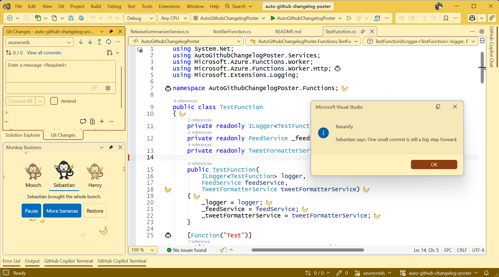

# Bananify for Visual Studio 2026

A little monkey business for your IDE. Bananify brings banana decorations, three monkey companions, and a local banana party to Visual Studio—without changing your source code.

## Bring the whole bunch

- **Playful editor decorations:** add banana and monkey artwork to visible source editors. Choose a banana level from **1–5**; decorations never edit source text or add undo records.
- **Two party panels:** dock **Monkey Business** beside your tools, or open the larger **Banana Party** in the document area. Both show the current banana level, dancing monkeys, and falling bananas.
- **Three companions:** choose **Mooch**, **Sebastian**, or **Henry** from the panel or settings.
- **A little encouragement:** select **Encourage me** for a local, randomly chosen phrase from your monkey. The panels and menu command share 40 phrases without consecutive repeats. Encouragement still works while decorations are paused or off.
- **Optional celebrations:** celebrate completed saves and successful builds with a message and a brief banana burst in visible party panels.
- **Four optional IDE themes:** choose **Banana Grove**, **Banana Cream**, **Midnight Banana**, or **Monkey Jungle**. Installing Bananify never changes your selected theme automatically.
- **Optional Solution Explorer badges:** add reversible banana badges for visible editor files in supported **SDK-style C# and VB projects**. Other project types are not supported for badges.

## Start your party

Open **Tools > Bananify**:

| Command | What it does |
| --- | --- |
| **Toggle Banana Party** | Turn editor decorations on or restore the editor. |
| **Open Banana Party** | Open the compact **Monkey Business** panel and start the party. |
| **Open Large Banana Party** | Open the larger party window and start the party. |
| **More Bananas** | Cycle the banana level from 1 through 5, then back to 1. |
| **Pause or Resume** | Take a break from decorations and animation, then resume. |
| **Restore Editor** | Stop decorations and badges, and hide the larger party window. |
| **Ask a Monkey for Encouragement** | Show an encouragement phrase in a dialog. |
| **Bananify Settings** | Open the extension options. |

Decorations are **off by default**. Configure density, companion, reduced motion, badges, and celebrations under **Tools > Options > Bananify > General**. Select the optional themes through Visual Studio's theme settings.

## How celebrations work

Enable **Celebrate completed saves** and/or **Celebrate successful solution builds** in settings. Keep a party panel visible and the party active and unpaused.

- A completed document save shows **Save completed!**
- A successful build shows **Build succeeded!** Failed or canceled builds and clean-only operations do not announce success.
- Saves and builds share a **five-second cooldown**. A save immediately before a fast build can suppress that second celebration.
- Celebrations never open or focus a window, and hidden panels do not replay missed events.
- With reduced motion, celebrations use readable text instead of moving particles.

To try it, open **Monkey Business**, enable save celebrations, edit a source file, and save. For a separate build celebration, wait more than five seconds before building the already-saved solution.

## Your IDE, your pace

**Reduce motion**, Windows animation preferences, and high contrast keep the party static. Panel colors follow the selected IDE theme. Pause and Restore leave source files untouched; Restore does not undo a theme you deliberately selected.

Artwork, phrases, and party assets are bundled locally. Bananify does not collect telemetry or upload your code. Preferences use Visual Studio's per-user settings; WebView2 stores its browser data under the owning IDE's local data directory. WebView2 runtime and updater behavior are managed separately by Microsoft.

## Compatibility and project status

This extension is intended for **Visual Studio 2026 on Windows**, not Visual Studio Code. The native host targets .NET Framework 4.8, and party panels use the Microsoft Edge WebView2 Runtime. If the party view cannot initialize, the extension offers retry and restore controls.

**Development preview:** VS2026 experimental-instance qualification is still required before a public release, including AMD64/ARM64 behavior, theme rendering, and supported Solution Explorer badge refresh. A successful build or automated browser test is not a substitute for those checks.

## Learn more and get help

- [Bananify website](https://bananify.online)
- [Source code and development guide](https://github.com/jamesmontemagno/bananify/tree/main/visual-studio-extension)
- [Report an issue](https://github.com/jamesmontemagno/bananify/issues)
- [MIT license](https://github.com/jamesmontemagno/bananify/blob/main/LICENSE)
