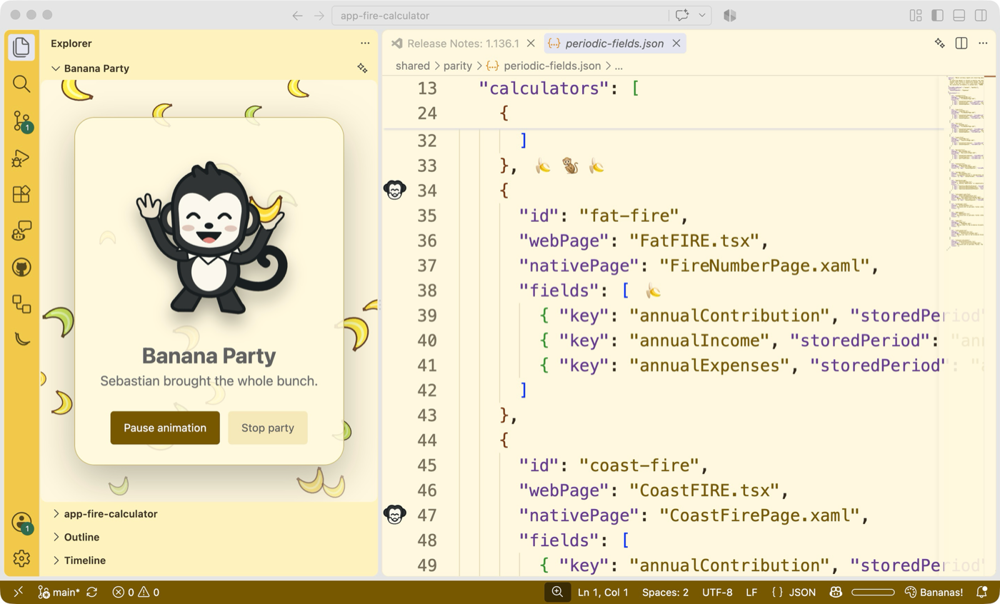

# Bananify for Visual Studio Code

Give your editor a harmless banana party. Bananify adds stable banana and illustrated monkey decorations to every visible editor pane, four optional color themes, and a little troop of monkeys in the Activity Bar.



## Features

- Run **Bananify: Toggle Banana Party** from the Command Palette or click the banana status item.
- Turn the party on for the maximum default density across split editors, with stable
  mixes of bananas, monkey flourishes, and illustrated gutter art. Choose a lower
  density in Settings when you want a quieter party.
- Open the Bananify Activity Bar panel to meet Mooch, Sebastian, and Henry, choose a pal, or ask for encouragement.
- Expand the compact **Banana Party** section in Explorer for a three-monkey troop
  beside your files, or run **Bananify: Open Banana Party Editor Tab** for the
  larger version. Both are opt-in, share pause/stop state, use bounded falling
  bananas, and burst a small illustrated bunch wherever you click inside the view.
- Run **Bananify: Choose Banana Theme** to preview Banana Grove, Banana Cream, Midnight Banana, or Monkey Jungle. Bananify never changes your theme automatically.
- Run **Restore Editor** to remove decorations, stop status animation, and close the Party tab. Source files are never modified.

The extension performs no network requests and does not collect telemetry.

Banana text decorations use supported editor decorations. Illustrated monkeys use the
editor gutter and therefore share that space with native editor features such as
breakpoints. Bananify does not claim priority over those features.

## Settings

| Setting | Default | Purpose |
| --- | --- | --- |
| `bananify.decorations.enabled` | `false` | Show banana editor decorations. |
| `bananify.decorations.density` | `5` | Choose a decoration level from 1 to 5; parties start at full intensity. |
| `bananify.monkey` | `brown` | Choose the monkey shown in the panel. |
| `bananify.reducedMotion` | `false` | Reduce native status/sidebar motion; webviews also honor the system preference. |
| `bananify.celebrations.onSave` | `false` | Briefly celebrate saves on visible Bananify surfaces. |
| `bananify.celebrations.onSuccessfulTask` | `false` | Briefly celebrate tasks that exit with code 0. |

Celebrations are disabled by default, globally rate-limited, and never open or focus a
view. Hidden webviews do not run animation loops.

## Development

Use Node.js 22 or newer.

```sh
npm ci
npm run lint
npm run check
npm test
npm run test:smoke
npm run package
```

Press **F5** from this directory in VS Code to launch an Extension Development Host.

## Publishing

The extension keeps an explicit version in `package.json` and publishes from tags named
`vscode-v<version>`.

### One-time setup

1. Ensure the Visual Studio Marketplace publisher `vs-publisher-473885` owns the
   `bananify` extension.
2. Create a Marketplace personal access token with permission to publish extensions.
3. Add the token to this GitHub repository as either `VSCE_PAT` or `VSCE_TOKEN`.
4. Optionally, claim the matching `vs-publisher-473885` namespace on
   [Open VSX](https://open-vsx.org/), create a publishing token, and add it as
   the `OVSX_PAT` repository secret.

### Create a release

From `vscode-extension`, replace `0.1.1` with the intended next version:

```sh
npm version 0.1.1 --no-git-tag-version
npm ci
npm run release:check
npm run lint
npm run check
npm test
npm run test:smoke
npm run package
git add package.json package-lock.json
git commit -m "Release Bananify for VS Code 0.1.1"
git tag vscode-v0.1.1
git push origin HEAD
git push origin vscode-v0.1.1
```

The tag workflow tests and packages the extension, publishes the tested VSIX to the
Visual Studio Marketplace, creates or updates the matching GitHub Release, and
attaches the VSIX. When `OVSX_PAT` is configured, it also publishes the same VSIX
to Open VSX.

### Publish a local package

```sh
npm ci
npm run package
npm exec -- vsce publish --packagePath bananify-vscode.vsix --pat "$VSCE_PAT"
npm exec -- ovsx publish bananify-vscode.vsix --pat "$OVSX_PAT"
```

## Privacy

Bananify reads only the visible document lines needed to place decorations. It does not change files, open network connections, track usage, or send code anywhere.

## License

[MIT](LICENSE)
